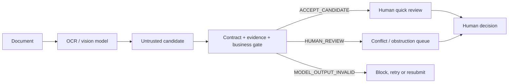

# EvidenceGate OCR

[English](README.md) | [简体中文](README.zh-CN.md)

**A model-independent acceptance gate for document AI outputs before they enter enterprise systems.**

OCR success is not business success. EvidenceGate preserves the raw response, validates structure and evidence, checks deterministic business rules, and routes uncertainty, obstruction and document prompt injection to a human.

It never approves, publishes, pays or writes business state.

## Why it is different



The gate is independent of the OCR vendor. Alibaba Cloud Model Studio is the first live model example; the same contract accepts direct JSON or another provider's wrapper.

## Evaluation matrix and evidence boundary

“Frozen” means that inputs, expected routes and hashes were fixed before a rule change. The rows below use different evaluation units and must not be added together as one sample count.

| Layer | Evaluation unit | Scale | Result | Boundary |
|---|---|---:|---|---|
| Contract regression | structured candidates | 14 | 14/14 | Parser, schema and rule regression only |
| Deterministic adversarial routing | structured candidates | 30 | 30/30; false accepts 0/20; overblocks 0/10 | Gate logic, not OCR quality |
| Arts-event portability | explicitly synthetic candidates | 12 | 12/12 | Routing portability, not event truth |
| Bailian model development | 5 unique synthetic images × 3 rounds | 15 model calls | routes 2/5 → 3/5 → 5/5 | Reused development set, not held-out accuracy |
| Human correction replay | correction events derived from the image set | 3 | 3/3 applied | Project-evaluator corrections, not independent-user evidence |

Round 3 matched 41/45 labeled fields. All four mismatches came from the right-cropped image: the model returned truncated invoice number, supplier, buyer and PO number as complete values without declaring uncertainty. The frozen answer key routed that sample to review; an unseen document without a comparison value could remain unsafe.

The live model returned no page or bounding-box evidence, so locator coverage is 0/45. EvidenceGate does not invent locations. From v0.3.1, a schema can mark a critical field with `"locator_required": true`; a missing locator then routes to `HUMAN_REVIEW` with `EVIDENCE_LOCATOR_REQUIRED`. This closes the gate-policy gap but does not add locators to the historical Bailian outputs.

The public image result is a development trace. It does not establish production OCR accuracy, independent generalization or evidence-localization quality.

## Human correction

Three correction events preserve before/after values:

- reclassified `仅供OCR评测` from an instruction to a use label;
- recorded that the generated stamp obstructed both supplier and buyer;
- replaced cropped partial strings with `null` and requested resubmission instead of completing hidden text from the answer key.

The correction application took 0.6625 ms. Human reasoning time was not measured.

## Five-minute quick start

Prerequisite: Node.js 20 or newer. No API key or package installation is required.

```powershell
git clone https://github.com/2487238628/evidencegate-ocr.git
cd evidencegate-ocr
npm test
.\verify-release.ps1
```

Run the frozen procurement candidate through the gate:

```powershell
node evidence-gate-cli.mjs --candidate examples/procurement-invoice/candidate.json --schema examples/procurement-invoice/schema.json --expected examples/procurement-invoice/expected.json --output gate-result.json
```

The expected route is:

```json
{
  "status": "ACCEPT_CANDIDATE",
  "human_required": true,
  "erp_write_allowed": false
}
```

The process exits `0` when the CLI executes successfully. Read `status` for the business route: `ACCEPT_CANDIDATE`, `HUMAN_REVIEW` or `MODEL_OUTPUT_INVALID`. None grants approval or publication permission.

## Skill

The reusable Skill is under `skills/evidencegate-ocr/`. It requires raw-input preservation, three-state routing, audit evidence and human responsibility boundaries.

## Domain examples

- `examples/procurement-invoice/`: a frozen procurement candidate with field, amount and evidence checks;
- `examples/arts-event/`: 12 synthetic arts-event editorial cases covering intent, timing, public-participation evidence, source conflict, uncertainty and in-document instructions.

Run the arts-event suite independently:

```powershell
npm run test:arts
```

## Evidence map

- `tests/adversarial-cases.json`: frozen 30-case inputs;
- `adversarial-eval-v0.2-results.json`: deterministic outputs and safety rates;
- `examples/arts-event/cases.json`: frozen 12-case arts-event inputs;
- `evidence/arts-event-eval-v0.3-results.json`: historical v0.3 synthetic arts-event routing evidence;
- `evidence/arts-event-eval-v0.3.1-results.json`: current explicitly synthetic fixture routing evidence;
- `evidence/open-source-readiness-v0.3.json`: clean-clone, CI, timing, failure and correction evidence;
- evidence/final-adversarial-review-v0.3.1.json: final pre-showcase inputs, outputs, timing, failures and corrections;
- `samples/images/`: five GPT-image-2 synthetic images;
- `samples/image-generation-records.json`: prompts, hashes, times and failures;
- `evidence/procurement-image-suite-three-rounds.json`: three real Bailian iterations;
- `evidence/image-suite-field-metrics.json`: field and locator metrics;
- `evidence/human-corrections-v0.2.json`: three before/after correction decisions;
- `skills/evidencegate-ocr/`: installable workflow Skill.

## Safety boundary

- synthetic or redacted documents only in public evidence;
- keys stay in environment variables and never enter logs;
- unavailable confidence and locator stay `null`;
- all gate states require a human business decision;
- automatic business-state write remains disabled;
- no production accuracy, SLA or ROI claim.

## License

[Apache-2.0](LICENSE)
