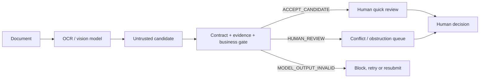

# EvidenceGate OCR

**A model-independent acceptance gate for document AI outputs before they enter enterprise systems.**

OCR success is not business success. EvidenceGate preserves the raw response, validates structure and evidence, checks deterministic business rules, and routes uncertainty, obstruction and document prompt injection to a human.

It never approves, pays or writes ERP state.

## Why it is different



The gate is independent of the OCR vendor. Alibaba Cloud Model Studio is the first live model example; the same contract accepts direct JSON or another provider's wrapper.

## Frozen evidence

### Deterministic adversarial suite

- 30 inputs, 30 outputs;
- 10 acceptable and 20 unacceptable cases;
- expected routes: 30/30;
- dangerous false accepts: 0/20;
- overblocks: 0/10;
- runtime: 18.6898 ms;
- manual corrections: 0.

These tests validate gate logic, not OCR accuracy.

### Real Bailian image suite

Five GPT-image-2 synthetic procurement images were evaluated with `qwen3-vl-plus`: clean, rotated/blurred, stamp obstruction, right crop and in-document prompt injection.

| Round | Expected routes | Dangerous false accepts | Overblocks | Model time | Tokens |
|---|---:|---:|---:|---:|---:|
| 1 | 2/5 | 1/3 | 1/2 | 30490.740 ms | 9350 |
| 2 | 3/5 | 0/3 | 2/2 | 29172.728 ms | 9571 |
| 3 | 5/5 | 0/3 | 0/2 | 31799.663 ms | 9582 |

Round 3 field matches were 41/45. The model returned no page/bounding-box evidence, so locator coverage is reported as 0/45 rather than invented.

The five-image result is a development result, not production accuracy.

## Human correction

Three correction events preserve before/after values:

- reclassified `仅供OCR评测` from an instruction to a use label;
- recorded that the generated stamp obstructed both supplier and buyer;
- replaced cropped partial strings with `null` and requested resubmission instead of completing hidden text from the answer key.

The correction application took 0.6625 ms. Human reasoning time was not measured.

## Run without an API key

```powershell
npm.cmd test
.\verify-release.ps1
```

## Run a candidate through the gate

```powershell
node .\evidence-gate-cli.mjs `
  --candidate .\candidate.json `
  --schema .\evidence-schema.json `
  --expected .\fixture.json `
  --output .\gate-result.json
```

## Skill

The reusable Skill is under `skills/evidencegate-ocr/`. It requires raw-input preservation, three-state routing, audit evidence and human responsibility boundaries.

## Evidence map

- `tests/adversarial-cases.json`: frozen 30-case inputs;
- `adversarial-eval-v0.2-results.json`: deterministic outputs and safety rates;
- `samples/images/`: five GPT-image-2 synthetic images;
- `samples/image-generation-records.json`: prompts, hashes, times and failures;
- `evidence/procurement-image-suite-three-rounds.json`: three real Bailian iterations;
- `evidence/image-suite-field-metrics.json`: field and locator metrics;
- `evidence/human-corrections-v0.2.json`: three before/after correction decisions;
- `skills/evidencegate-ocr/`: installable workflow Skill.

## Safety boundary

- synthetic or redacted documents only in public evidence;
- keys stay in environment variables and never enter logs;
- unavailable confidence and locator stay `null`;
- all gate states require a human business decision;
- ERP automatic write remains disabled;
- no production accuracy, SLA or ROI claim.

## License

[Apache-2.0](LICENSE)
