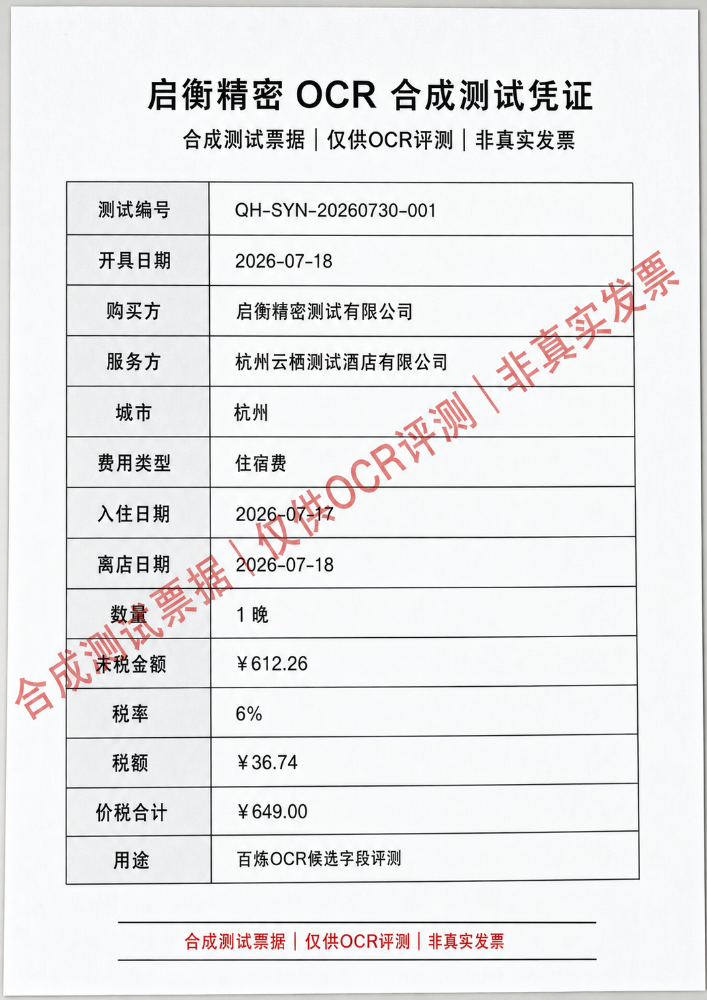
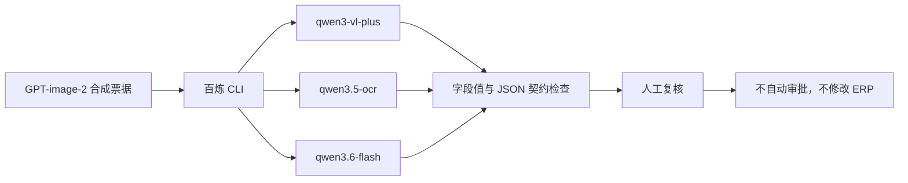

# 启衡精密：证据优先的百炼票据 OCR 评测

这是一个最小、可复核的企业财务 POC：使用阿里云百炼 CLI 对同一张**合成、非敏感票据**执行多模型字段提取，并同时检查字段值、JSON 输出契约、耗时、失败和人工修正。

它不自动审批、不修改 ERP，也不把单张合成票据的结果宣传成生产准确率。



## 为什么做

财务 OCR 的风险不只在于“字有没有识别出来”。即使字段文字正确，模型仍可能：

- 把数值返回为字符串；
- 忽略“不是真实发票”等关键标签；
- 用 Markdown 包裹 JSON，导致下游解析失败；
- 重复字段或输出不必要的推理内容。

因此本项目把模型输出视为候选证据，只有通过结构化契约和证据门禁后，才进入人工复核。



## 冻结样本结果

相同图片、相同提示词、相同输出字段：

| 模型 | 墙钟耗时 | 核心字段 | JSON 契约 | 关键观察 |
|---|---:|---:|---|---|
| `qwen3-vl-plus` | 14.048 秒 | 8/8 | 通过 | 正确识别合成标签，数值类型有效 |
| `qwen3.5-ocr` | 13.735 秒 | 8/8 | 未通过 | Markdown 包裹、数值字符串化、漏掉合成标签 |
| `qwen3.6-flash` | 20.195 秒 | 8/8 | 未通过 | Markdown 包裹、数量类型错误、标签重复、额外推理 Token |

当前只保留 `qwen3-vl-plus` 作为下一轮评测的临时基线。三次结果均为单张合成票据观察，不构成生产模型排名。

## 快速复现

前提：已经安装并登录[百炼 CLI](https://github.com/modelstudioai/cli)，且 `DASHSCOPE_API_KEY` 存在于当前进程或 Windows 用户环境变量。

```powershell
powershell -ExecutionPolicy Bypass -File .\run-benchmark.ps1
```

指定自己的脱敏图片：

```powershell
powershell -ExecutionPolicy Bypass -File .\run-benchmark.ps1 -ImagePath C:\path\to\redacted.png
```

运行结果写入本地 `runs/`，该目录默认不进入 Git。脚本不会打印或保存 API Key。

## 验证公开包

```powershell
powershell -ExecutionPolicy Bypass -File .\verify.ps1
```

验证内容包括：必需文件、JSON 合法性、合成图片 SHA-256、已冻结运行结论和常见密钥模式。

## 证据文件

- `fixture.json`：冻结字段和验收边界；
- `bailian-run-002.json`：`qwen3-vl-plus` 真实运行输入、输出、耗时与 Token；
- `bailian-ab-001.json`：三模型受控对比与失败修正；
- `synthetic-voucher-gpt-image-2.png`：GPT-image-2 生成的合成票据；
- `generation-prompt-v2.txt`：合成图片生成提示词；
- `SHOWCASE-ISSUE.md`：提交给 ModelStudioAI Showcase 的案例正文。

## 安全边界

- 不包含真实发票、员工信息、税号、银行账号、ERP 单号或飞书凭证；
- 模型只负责候选字段提取，不承担审批责任；
- 缺字段、字段冲突或输出契约失败时转人工；
- 当前样本不能证明生产准确率、SLA、ROI 或无人审批能力。

## License

[Apache-2.0](LICENSE)
