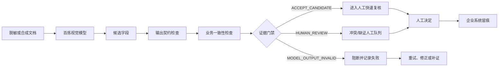

# EvidenceGate OCR：模型结果进入企业系统前的证据门禁

EvidenceGate OCR 不是另一个“发票识别 Demo”。它解决的是 OCR 项目里更靠近生产、也更容易被忽略的一步：

> 模型读出的字段只能作为候选证据；只有通过输出契约、业务一致性和样本预期检查，才能进入人工复核，不能直接写回 ERP。

“启衡精密住宿票据”是第一个真实百炼示例，不是工具边界。仓库还提供了一个独立的采购发票 schema，证明同一门禁核心可以在不改代码的情况下切换字段与规则。


## 与普通 OCR 案例的差异

普通 OCR Demo 通常止于“图片 → 字段”。EvidenceGate 在模型与企业系统之间增加了可审计的门禁：



三种状态都不是自动审批：

- `ACCEPT_CANDIDATE`：模型输出可被下游解析，规则和冻结字段未发现冲突，仍需人工决定；
- `HUMAN_REVIEW`：结构合法，但金额、日期、安全标签或冻结样本预期有冲突；
- `MODEL_OUTPUT_INVALID`：JSON、字段、类型或证据元数据不满足契约，阻断进入业务系统。

## 可复用输入与输出

输入：

- 模型直接返回的 JSON；
- 百炼 CLI `--output json` 的 `choices[0].message.content`；
- 可选证据封套：`fields` 加逐字段 `locator`、`confidence`；
- 一份可替换的 schema；
- 可选冻结样本。

输出为逐字段证据封套，包含候选值、来源、页码/位置、模型置信度、契约错误、业务规则错误、冻结样本差异、人工修正占位和门禁状态。模型没有返回的坐标和置信度保留为 `null`，不虚构证据。

## 两个业务 schema

### 1. 启衡住宿费用示例

`evidence-schema.json` 检查 17 个字段，并执行：

- 字段必填、类型和未知字段检查；
- 未含税金额 + 税额 = 含税总额；
- 入住日期早于离店日期；
- 合成/非真实安全标签必须可见；
- 8 个冻结关键字段与人工样本一致。

### 2. 独立采购发票示例

`examples/procurement-invoice/` 改为供应商、采购方、币种、采购订单号和三项金额，不改门禁代码。真实确定性运行结果：

- 输入：1 条合成采购发票候选；
- 输出：1 条逐字段证据封套；
- 状态：`ACCEPT_CANDIDATE`；
- 契约错误：0；
- 业务规则错误：0；
- 人工修正：0；
- ERP 写入：禁止。

这证明的是配置可迁移，不证明采购发票 OCR 准确率。

## v0.2 真实百炼运行证据

2026-07-31 使用 `qwen3-vl-plus` 对同一张 GPT-image-2 合成票据重新执行：

| 项目 | 真实结果 |
|---|---:|
| 输入图片 | 1 |
| 模型输出 | 1 |
| 模型退出码 | 0 |
| 模型墙钟耗时 | 8151.889 ms |
| 提示 Token | 1699 |
| 输出 Token | 244 |
| 总 Token | 1943 |
| 门禁耗时 | 0.4568 ms |
| 契约错误 | 0 |
| 业务规则错误 | 0 |
| 冻结字段差异 | 0 |
| 门禁状态 | `ACCEPT_CANDIDATE` |
| 人工最终决定 | 必须 |
| ERP 自动写入 | 禁止 |

开发过程中同时保留了两次失败：

1. 子 PowerShell 进程没有读到用户级 `DASHSCOPE_API_KEY`，模型调用前失败；修正为在当前进程安全加载，不打印、不落盘。
2. 百炼 CLI 的 UNDICI 网络代理警告经 PowerShell 错误流触发终止；修正为警告写入审计日志，只有 CLI 非零退出码才判调用失败。

完整输入、输出、耗时、失败和人工修正见 `bailian-evidencegate-v0.2-run.json`。

## 历史三模型受控比较

`bailian-ab-001.json` 保留同图、同提示词、同字段的首次比较：

| 模型 | 墙钟耗时 | 核心字段 | JSON 契约 | 关键观察 |
|---|---:|---:|---|---|
| `qwen3-vl-plus` | 14.048 秒 | 8/8 | 通过 | 数值类型有效，识别合成标签 |
| `qwen3.5-ocr` | 13.735 秒 | 8/8 | 未通过 | Markdown 包裹、数值字符串化、漏合成标签 |
| `qwen3.6-flash` | 20.195 秒 | 8/8 | 未通过 | 数量类型错误、标签重复、额外推理 Token |

这只能证明三个具体调用在一张合成票据上的差异，不构成生产模型排名。

## 13 条冻结门禁测试

`tests/gate-cases.json` 覆盖正常候选、Markdown、非法 JSON、必填缺失、`null`、类型错误、未知字段、安全标签缺失、金额不守恒、日期冲突、冻结字段冲突、标准证据封套和越界置信度。

真实结果：

- 输入：13；
- 输出：13；
- 通过：13；
- 失败：0；
- 人工修正：0；
- 确定性脚本耗时：3.4249 ms。

这 13 条只验证门禁逻辑，不测 OCR 准确率。

## 快速使用

无需 API Key，先验证门禁与公开证据：

```powershell
node .\test-gate.mjs
powershell -ExecutionPolicy Bypass -File .\verify.ps1
```

校验已有候选文件：

```powershell
node .\evidence-gate-cli.mjs `
  --candidate .\path\to\candidate.json `
  --schema .\evidence-schema.json `
  --expected .\fixture.json `
  --output .\path\to\gate-result.json
```

真实调用百炼并自动执行门禁：

```powershell
powershell -ExecutionPolicy Bypass -File .\run-benchmark.ps1
```

默认只调用 `qwen3-vl-plus`，避免无意产生三次费用。需要受控比较时再显式传入：

```powershell
powershell -ExecutionPolicy Bypass -File .\run-benchmark.ps1 `
  -Models qwen3-vl-plus,qwen3.5-ocr,qwen3.6-flash
```

结果写入被 Git 忽略的 `runs/`。脚本不会打印或保存 API Key。

## 当前边界

已经具备：

- 两个可替换业务 schema；
- 百炼返回封套解析；
- 确定性契约、金额、日期和安全标签检查；
- 三态人工路由；
- 逐字段证据封套；
- 13 条公开回归测试；
- 输入 SHA-256、Token、耗时、失败和人工修正记录；
- 默认禁止 ERP 写入。

尚未声称：

- 任意票据、任意版式或任意图片质量都可识别；
- 生产准确率、SLA 或 ROI；
- 自动审批、付款或无人值守；
- 模型没有返回的坐标、置信度或制度依据。

下一阶段应扩充多版式合成文档和人工标注字段集；在样本分层、人工标签和真实用户试点完成前，不增加 RAG、多 Agent 或自动写回。

## 公开证据

- `evidence-schema.json`：住宿费用字段、提示词与规则；
- `examples/procurement-invoice/`：脱离启衡的第二个配置化示例；
- `evidence-gate.mjs` / `evidence-gate-cli.mjs`：门禁核心与命令行入口；
- `tests/gate-cases.json`：冻结测试输入；
- `evidence-gate-v0.2-test-results.json`：门禁测试输出、耗时、失败与人工修正；
- `bailian-evidencegate-v0.2-run.json`：v0.2 百炼真实运行与两次失败修正；
- `bailian-run-002.json` / `bailian-ab-001.json`：首轮百炼基线与受控比较；
- `synthetic-voucher-gpt-image-2.png`：GPT-image-2 生成的非敏感合成票据。

## License

[Apache-2.0](LICENSE)

